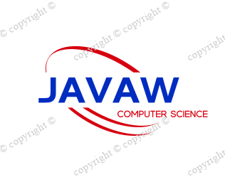

# Welcome to JavaW's Pages



#### [**查看我的个人简历**]()

## How to use?

* ### Archives :
> #### It is a chronological blog that records some of the problems I have encountered and some of my summaries

* ### Categories : 
> #### Divide blogs according to technology stack

* ### Tags : 
> #### Divide the corresponding problem tags in the blog


## Some corresponding code comments in this area
```html
// eg: the html code in this area
<div class="side ">
  <div>
    <i class="fa fa-th-list"></i>
    Categories
  </div>
  <ul class="content-ul" cate>
    <li>
      <a href="{{ root_url }}/{{ site.category_dir }}#{{ category | first }}" class="categories-list-item" cate="{{ category | first }}">
        <span class="name">
        </span>
        <span class="badge">{{ category | last | size }}</span>
      </a>
    </li>
  </ul>
</div>
```


## Support or Contact

**See my GitHub for more project source code in [JavaW](https://github.com/W-Java).**

**Use email to contact me [1140480798@qq.com](https://mail.qq.com/).**

